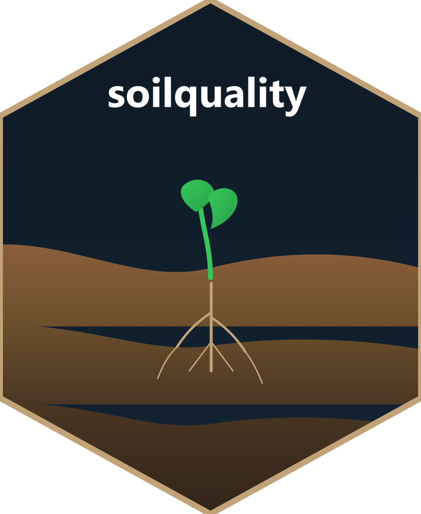

# soilquality 

<!-- badges: start -->
[](https://github.com/ccarbajal16/soilquality)
[](https://opensource.org/licenses/MIT)
<!-- badges: end -->

## Overview

The `soilquality` R package provides comprehensive tools for calculating Soil Quality Index (SQI) using scientifically validated methods. The package implements Principal Component Analysis (PCA) for Minimum Data Set (MDS) selection and Analytic Hierarchy Process (AHP) for expert-based weighting, transforming complex soil property data into standardized quality metrics.

## Key Features

- **Automated MDS Selection**: PCA-based dimensionality reduction to identify key soil indicators
- **Expert Weighting System**: AHP methodology with consistency ratio validation
- **Flexible Scoring Functions**: Multiple normalization methods for different soil properties
  - Higher-is-better (e.g., organic matter, nutrients)
  - Lower-is-better (e.g., bulk density, electrical conductivity)
  - Optimal range (e.g., pH)
  - Custom threshold-based scoring
- **Pre-defined Property Sets**: Standard collections for common soil analyses (basic, standard, comprehensive, physical, chemical, fertility)
- **Standard Scoring Rules**: Automatic rule assignment based on property patterns
- **Comprehensive Visualization**: Multiple plot types for results interpretation
- **Interactive Shiny Application**: GUI for non-programmers
- **Complete Documentation**: Vignettes, examples, and function references

## The pipeline, and the choice at every step

An index is five decisions, and this package offers alternatives at each of
them — plus the step most work skips.

```
select  →  group  →  score  →  weight  →  aggregate  →  VALIDATE
```

| Step | Options | Default | When to change it |
|---|---|---|---|
| **Select** | `pca_select_mds()` (variance), `na_select_mds()` (network centrality), expert list | PCA | Network when ecological hubs matter more than variance, or when normality is doubtful |
| **Group** | `groups = NULL`, `soil_function_groups` | none | Whenever more than one soil function matters — ungrouped selection can leave whole functions unrepresented |
| **Score** | linear, sigmoid, optimum, threshold, reference-soil | linear | Sigmoid to reproduce most published work; reference-soil for comparability across studies |
| **Weight** | AHP, PCA loading, network centrality, equal | equal | AHP when you have defensible expert judgement |
| **Aggregate** | `method = "weighted"`, `method = "area"` | weighted | Area to sidestep weighting entirely |
| **Validate** | `sqi_validate()`, `sqi_stability()` | — | **Always** |

### Why validation is the point

A soil quality index has **no ground truth**. Nothing tells you whether yours
is correct. What you can establish is whether it *discriminates*, and whether
your conclusion survives building it a different way.

`sqi_validate()` leads with the distribution across decision categories, not
with a correlation. Maaz et al. (2023) found two indices correlating at
**r = 0.96** while one placed **94 %** of plots in the middle band and the
other **61 %**. An index that calls almost everything "medium" cannot inform a
decision, however well it correlates with anything else.

`sqi_stability()` runs the same samples through several recipes and reports
whether the ranking survives. A high rank correlation does not rescue a
changed extreme, if the extreme is what you act on.

### One warning worth repeating

**Do not build an index from predicted soil properties.** Chaudhry et al.
(2024) found that computing an SQI from spectrally predicted properties gave
R² = 0.23, while predicting the index *directly* from the same spectra gave
R² = 0.90 — with individually acceptable property models. If you only have
predictions, model the index itself.

See `vignette("building-and-validating-an-sqi")` for the pipeline end to end.

## Installation

### From GitHub (Development Version)

#### Using pak (Recommended)

```r
# Install pak if needed
if (!requireNamespace("pak", quietly = TRUE)) {
  install.packages("pak")
}

# Install soilquality
pak::pak("ccarbajal16/soilquality")
```

#### Using devtools

```r
# Install devtools if needed
if (!requireNamespace("devtools", quietly = TRUE)) {
  install.packages("devtools")
}

# Install soilquality
devtools::install_github("ccarbajal16/soilquality")
```

### From CRAN (Stable Release)

```r
# Coming soon
install.packages("soilquality")
```

## Quick Start

### Basic Workflow

```r
library(soilquality)

# Load example data
data(soil_data)

# Compute SQI with automatic property detection
result <- compute_sqi_properties(
  data = soil_data,
  properties = c("Sand", "Silt", "Clay", "pH", "OM", "P", "K")
)

# View results summary
print(result)

# Visualize SQI distribution
plot(result, type = "distribution")

# Create comprehensive report
plot_sqi_report(result)
```

### Using Pre-defined Property Sets

```r
# Use standard property set
result <- compute_sqi_properties(
  data = soil_data,
  properties = soil_property_sets$standard
)
```

### Custom Scoring Rules

```r
# Define custom scoring for specific properties
custom_rules <- list(
  pH = optimum_range(optimal = 6.5, tolerance = 1),
  OM = higher_better(),
  BD = lower_better(),
  P = threshold_scoring(
    thresholds = c(0, 10, 20, 50),
    scores = c(0, 0.5, 0.8, 1.0)
  )
)

result <- compute_sqi_properties(
  data = soil_data,
  properties = c("pH", "OM", "BD", "P"),
  scoring_rules = custom_rules
)
```

### Interactive AHP Matrix Creation

```r
# Create AHP matrix interactively
indicators <- c("pH", "OM", "P", "K")
ahp_matrix <- create_ahp_matrix(indicators, mode = "interactive")

# Use computed AHP weights in SQI calculation
result <- compute_sqi_properties(
  data = soil_data,
  properties = ahp_matrix$indicators,
  pairwise_matrix = ahp_matrix$weights
)
```

### Launch Interactive Application

```r
# Start Shiny app for GUI-based analysis
run_sqi_app()
```

## Main Functions

### Data Handling
- `read_soil_csv()` - Import soil data from CSV files
- `standardize_numeric()` - Z-score standardization of numeric columns
- `to_numeric()` - Safe type conversion

### PCA and MDS Selection
- `pca_select_mds()` - PCA-based minimum data set selection

### AHP Weighting
- `ahp_weights()` - Calculate weights from pairwise comparison matrix
- `create_ahp_matrix()` - Interactive or programmatic matrix creation
- `ratio_to_saaty()` - Convert importance ratios to Saaty scale

### Scoring Functions
- `score_higher_better()` - Normalize properties where higher is better
- `score_lower_better()` - Normalize properties where lower is better
- `score_optimum()` - Normalize properties with optimal range
- `score_threshold()` - Custom piecewise scoring
- `score_indicators()` - Apply scoring to multiple indicators

### Scoring Constructors
- `higher_better()` - Constructor for higher-is-better rules
- `lower_better()` - Constructor for lower-is-better rules
- `optimum_range()` - Constructor for optimal range rules
- `threshold_scoring()` - Constructor for threshold-based rules

### Property Sets and Standard Rules
- `soil_property_sets` - Pre-defined property collections
- `standard_scoring_rules()` - Automatic rule assignment

### SQI Computation
- `compute_sqi()` - File-based workflow
- `compute_sqi_df()` - In-memory workflow
- `compute_sqi_properties()` - Enhanced workflow with property selection

### Visualization
- `plot.sqi_result()` - S3 plot method with multiple types
- `plot_sqi_report()` - Multi-panel visualization report

### Interactive Tools
- `run_sqi_app()` - Launch Shiny application

## Documentation

Comprehensive documentation is available through:

- **Vignettes**:
  - [Introduction to soilquality](vignettes/introduction.Rmd) - Basic workflow and concepts
  - [Advanced Usage](vignettes/advanced-usage.Rmd) - Custom scoring and property selection
  - [AHP Matrices Guide](vignettes/ahp-matrices.Rmd) - Creating and interpreting pairwise comparisons

- **Function Reference**: Access help for any function with `?function_name`

- **Package Website**: [https://ccarbajal16.github.io/soilquality](https://ccarbajal16.github.io/soilquality)

## Citation

If you use this package in your research, please cite it as:

```r
citation("soilquality")
```

Or use:

> Carbajal, Carlos (2025). soilquality: Soil Quality Index Calculation with PCA and AHP.
> R package version 1.0.0. https://github.com/ccarbajal16/soilquality

## Contributing

Contributions are welcome! Please feel free to submit a Pull Request or open an Issue for:

- Bug reports
- Feature requests
- Documentation improvements
- Code contributions

## Issues and Support

Please report issues at: https://github.com/ccarbajal16/soilquality/issues

For questions and discussions, use the GitHub Discussions page.

## License

This package is licensed under the MIT License. See the [LICENSE](LICENSE) file for details.

## Acknowledgments

This package implements methodologies from soil quality assessment literature, including PCA-based MDS selection and AHP weighting approaches widely used in soil science research.
