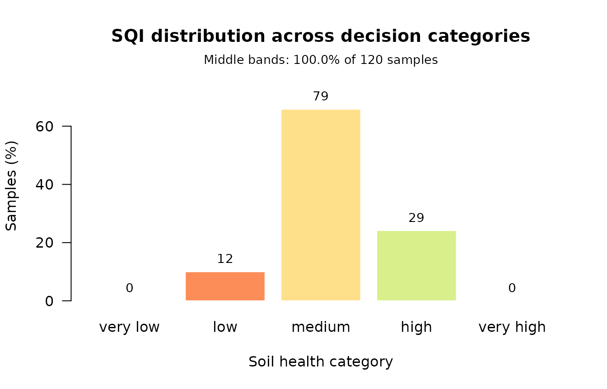

# Building and validating a Soil Quality Index

``` r

library(soilquality)
```

A soil quality index is a pipeline of five decisions, and this package
now offers a choice at every one of them:

    select  →  group  →  score  →  weight  →  aggregate  →  VALIDATE

The last step is the one most often skipped, and the one this vignette
treats as the point of the exercise. An index has **no ground truth**.
Nothing tells you whether yours is right. What you *can* establish is
whether it discriminates, and whether your conclusion survives building
it differently.

We use `soil_structured`, which is simulated but carries the covariance
real soil has: texture summing to 100, organic carbon tied to organic
matter, exchange capacity generated by clay and organic colloids.

``` r

props <- c("Sand", "Silt", "Clay", "BD", "pH", "OM", "SOC",
           "N", "P", "K", "CEC", "Ca", "Mg", "S", "EC")
str(soil_structured[, props[1:6]])
#> 'data.frame':    120 obs. of  6 variables:
#>  $ Sand: num  45.5 60.6 46.3 45.8 59.2 70 57.4 59.1 43.5 45.9 ...
#>  $ Silt: num  24.4 27.7 32.8 33.4 19.7 22 25.8 24.5 30.4 32.7 ...
#>  $ Clay: num  30.1 11.7 20.9 20.8 21.1 8 16.8 16.4 26.1 21.4 ...
#>  $ BD  : num  1.41 1.49 1.58 1.47 1.75 1.65 1.67 1.63 1.63 1.5 ...
#>  $ pH  : num  5.5 5.2 6.1 6.1 5 5.3 5.3 4.7 6.3 4.8 ...
#>  $ OM  : num  5.42 4.98 3.27 4.1 0.9 2.97 2.1 2.52 3.24 4.27 ...
```

## Step 0. Is the data worth factoring at all?

Almost no published index checks this. It costs one line.

``` r

pca_adequacy(soil_structured[, c("pH", "OM", "N", "P", "K", "CEC", "BD")])
#> PCA adequacy
#>   Observations: 120  Indicators: 7 
#> 
#> Kaiser-Meyer-Olkin: 0.813 (meritorious)
#>   Indicators below 0.60, worth considering for removal:
#>     pH         0.353
#> 
#> Bartlett's test of sphericity
#>   chi-squared = 1012.73, df = 21, p = 5.423e-201
#>   The matrix differs from the identity, so there is structure to
#>   factor. Note this test rejects on almost any real soil data.
```

Note what happens when the particle-size fractions are included: they
sum to 100 by construction, the correlation matrix becomes singular, and
KMO is undefined. That is a property of compositional data, not a bug,
and the function says so rather than returning a number.

``` r

pca_adequacy(soil_structured[, c("Sand", "Silt", "Clay", "pH", "OM")])$kmo_message
#> [1] "The correlation matrix is singular, so it cannot be inverted and KMO is undefined. This usually means some indicators are exactly collinear -- particle-size fractions summing to 100 is the classic case."
```

## Step 1. Select a minimum data set

Two routes, rewarding different things. PCA favours indicators carrying
**variance**; correlation-network analysis favours **hubs**.

``` r

std <- standardize_numeric(soil_structured[, props])

pca_route <- pca_select_mds(std)
pca_route$mds
#> [1] "pH"   "Silt"
```

``` r

net_route <- na_select_mds(soil_structured[, props])
net_route$mds
#> [1] "OM"  "CEC"
```

They disagree completely here, and that disagreement is informative
rather than embarrassing:
[`mds_consensus()`](https://ccarbajal16.github.io/soilquality/reference/mds_consensus.md)
returns the intersection, and an empty intersection is a signal to look
at the data before trusting either.

### The relative loading rule

[`pca_select_mds()`](https://ccarbajal16.github.io/soilquality/reference/pca_select_mds.md)
takes one indicator per component by default. The rule stated in the
literature keeps everything within 10 % of the top loading, which
usually gives a larger set:

``` r

length(pca_select_mds(std)$mds)
#> [1] 2
length(pca_select_mds(std, within = 0.10)$mds)
#> [1] 2
```

## Step 2. Group by function

Selecting across the whole pool lets one dominant function crowd out the
others. Here, ungrouped selection leaves entire functions unrepresented:

``` r

groups <- assign_function_groups(props)
names(groups)
#> [1] "carbon_cycling"       "nutrient_cycling"     "physical_structure"  
#> [4] "buffering_filtration"

grouped <- pca_select_mds(std, groups = groups, selector = "norm")
grouped$mds
#> [1] "OM"   "P"    "Sand" "EC"
```

Group by **function**, not by physical/chemical/biological — Maaz et al.
(2023) tested that familiar split by confirmatory factor analysis and
found it has no statistical support.

## Step 3. Score

Linear is the package default. The sigmoidal curve dominates the
literature:

``` r

mds <- grouped$mds

linear_rules  <- standard_scoring_rules(mds, scoring = "linear")
sigmoid_rules <- standard_scoring_rules(mds, scoring = "sigmoid")

sigmoid_rules[[1]]
#> Scoring Rule: sigmoid_scoring 
#>   Type: Non-linear (sigmoidal) scoring
#>   Direction: Higher values are better 
#>   Reference (x0): mean of the indicator 
#>   Shape (b): 2.5
```

The literature contradicts itself on which is better, so compute both
and check whether your conclusion moves. That is Step 6.

### Scoring against a reference soil

Both of the above normalise against your own sample, which forces the
best site to score about 1 whatever its condition. Scoring against an
undisturbed reference is the documented escape — at the cost of needing
a defensible reference soil.

``` r

reference_rules <- list(
  OM = reference_scoring(reference = 5.5),
  BD = reference_scoring(reference = 1.05, direction = "lower"),
  pH = reference_scoring(reference = 6.5, direction = "optimum",
                         tolerance = 1.5)
)
reference_rules$BD
#> Scoring Rule: reference_scoring 
#>   Type: Standardised against a reference soil
#>   Direction: Lower values are better 
#>   Reference: 1.05
```

## Steps 4 and 5. Weight and aggregate

Weighting is the most contested step in the whole pipeline, which is a
good reason to try skipping it. The area route ignores weights entirely.

``` r

weighted <- compute_sqi_properties(
  soil_structured, properties = mds, id_column = "SampleID",
  scoring_rules = linear_rules, method = "weighted"
)

area <- compute_sqi_properties(
  soil_structured, properties = mds, id_column = "SampleID",
  scoring_rules = linear_rules, method = "area"
)

summary(weighted$results$SQI)
#>    Min. 1st Qu.  Median    Mean 3rd Qu.    Max. 
#>  0.2697  0.4816  0.5266  0.5382  0.5949  0.7991
```

## Step 6. Validate — the point of all this

``` r

validation <- sqi_validate(weighted)
#> Warning: 100% of samples fall in the middle bands (threshold 80%). An index
#> that declines to separate samples cannot inform a decision, however well it
#> correlates with anything else. Consider a scoring or aggregation route that
#> discriminates more strongly -- see sqi_stability().
validation
#> Soil Quality Index validation
#>   Samples: 120 
#> 
#> Distribution across decision categories
#>   very low          0    0.0%  
#>   low              12   10.0%  ####
#>   medium           79   65.8%  ##########################
#>   high             29   24.2%  ##########
#>   very high         0    0.0%  
#> 
#>   Middle bands: 100.0% of samples
#>   WARNING: above the 80% threshold. This index declines to separate
#>            most samples, so it cannot inform a decision.
#> 
#> Sensitivity index (max/min): 2.96
#>   Range: 0.2697 to 0.7991 (mean 0.5382, sd 0.1019)
```

The **distribution across decision categories** is the headline, not the
correlation with anything. Maaz et al. found two indices correlating at
r = 0.96 while one put 94 % of plots in the middle band and the other 61
%. An index that calls everything “medium” cannot inform a decision,
however well it correlates.

``` r

plot_sqi_validation(validation)
```



### Does the conclusion survive a change of recipe?

``` r

sigmoid <- compute_sqi_properties(
  soil_structured, properties = mds, id_column = "SampleID",
  scoring_rules = sigmoid_rules
)

sqi_stability(linear = weighted, sigmoid = sigmoid, area = area)
#> Soil Quality Index recipe stability
#>   Samples: 120 
#>   Indices: linear, sigmoid, area 
#> 
#> Pairwise rank agreement
#>   linear       vs sigmoid       rho =  0.948   top kept      bottom kept
#>   linear       vs area          rho =  0.903   top kept      bottom kept
#>   sigmoid      vs area          rho =  0.870   top kept      bottom kept
#> 
#>   Both extremes are preserved across every pair: the choice of
#>   recipe does not change which sample is best or worst.
```

A high rank correlation does not rescue a changed extreme. If the top
field is what you act on and it moves when you switch scoring functions,
you do not have a result — you have an artefact of the recipe.

### Fidelity to everything you measured

``` r

tds <- compute_sqi_df(
  soil_structured[, c("SampleID", props)],
  id_column = "SampleID", select = "none"
)

sqi_validate(weighted, tds = tds)$fidelity
#> Warning: 100% of samples fall in the middle bands (threshold 80%). An index
#> that declines to separate samples cannot inform a decision, however well it
#> correlates with anything else. Consider a scoring or aggregation route that
#> discriminates more strongly -- see sqi_stability().
#> $r_squared
#> [1] 0.04239681
#> 
#> $n
#> [1] 120
```

Read this carefully: the total-data-set index is **not ground truth**.
It is the index with everything in it. High fidelity means your reduced
set is faithful to your full measurement set, not that either is
correct.

## A decision table

| Step | Options | Default | When to change it |
|----|----|----|----|
| Select | `pca_select_mds`, `na_select_mds`, expert list | PCA | Network when hubs matter more than variance, or normality is doubtful |
| Group | `groups = NULL`, `soil_function_groups` | none | Whenever more than one soil function matters |
| Score | linear, sigmoid, optimum, threshold, reference | linear | Sigmoid to reproduce most published work; reference for cross-study comparability |
| Weight | AHP, loading, centrality, equal | equal | AHP when you have defensible expert judgement |
| Aggregate | `"weighted"`, `"area"` | weighted | Area to sidestep weighting entirely |
| Validate | `sqi_validate`, `sqi_stability` | — | Always |

## One warning worth repeating

Do not build an index from **predicted** properties. Chaudhry et
al. (2024) found that computing an SQI from spectrally predicted
properties gave R² = 0.23, while predicting the index directly from the
same spectra gave R² = 0.90 — with individually acceptable property
models. If you only have predictions, model the index itself.
